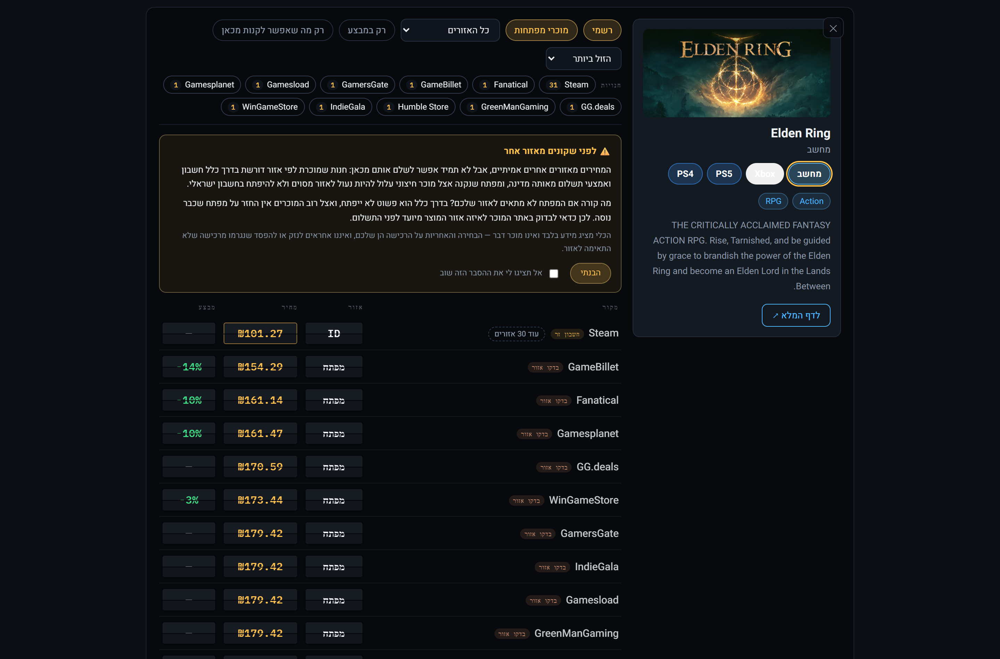
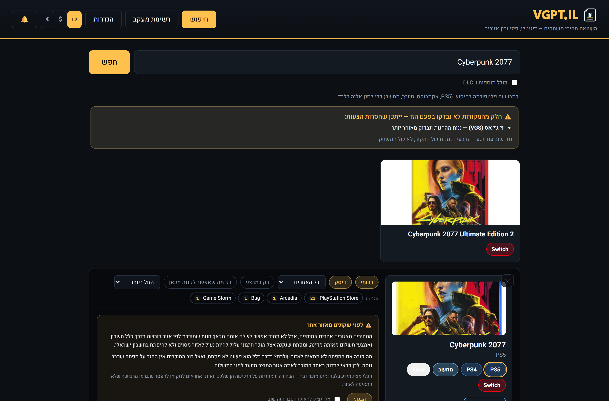
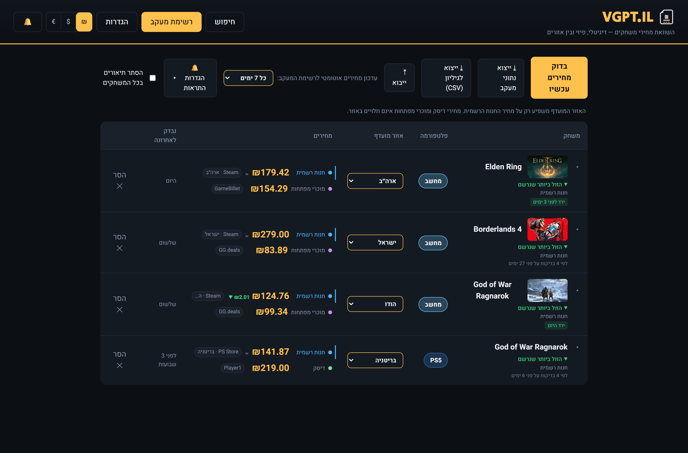

# VGPT.IL — משווה מחירי משחקים

**A Hebrew-first, right-to-left game price comparison and wishlist tracker built for the Israeli market.**
It answers one question properly: *where is this game actually cheapest for me, right now, and is this a good time to buy it?*

### ▶ [Try the live demo](https://noronkasher.github.io/game-price-il/)

The demo is the real app running against a **snapshot of real prices** recorded on one day. It is served
from GitHub Pages, which runs no server — so nothing is scraped live there. See
[Demo limits](#demo-limits) for exactly what is and isn't real.



---

## Why this exists

Buying a game in Israel is a mess of incomparable prices:

- **The same digital game costs wildly different amounts by store region.** Elden Ring above is ₪179 on
  the Israeli Steam page and ₪101 on the Indonesian one — a real difference that most price sites,
  which quote a single region, never show you.
- **Physical discs are still competitive here**, and the shops that sell them are small local retailers
  that no international price tracker has ever indexed.
- **Key resellers sit somewhere in between** — often genuinely cheaper, occasionally region-locked in a
  way that makes the key useless to an Israeli buyer.

So the tool compares all three side by side — official store, disc, and key reseller — converts
everything to shekels, and says plainly which risks come attached.

## What it does

**Compares 16 sources in one search.** Steam (per-region), PlayStation Store, Xbox, Nintendo, Epic,
Ubisoft Connect, EA App, CheapShark, GG.deals, IsThereAnyDeal, and six Israeli retailers —
VGS, Player1, Arcadia, Game Storm, Ivory and Bug.

**Shows regional prices honestly.** Every offer says which region it is from, and foreign-region rows
carry a badge explaining what can go wrong — a store may require a payment method from that country, a
key may be locked to it. The tool never blocks a purchase and never pretends to be the seller; it says
what it knows and lets you decide.

**Tracks prices over time and tells you whether now is a good moment.** A tracked game records its price
on a schedule, and the verdict beside it — *cheapest ever recorded*, *cheapest since March*, *12% above
its low* — is judged against that game's own history, on the same price series shown next to it.

**Alerts on real drops**, globally or per game, scoped so a game you track for a disc in a Tel Aviv shop
is never judged on a US digital price.

**Knows about Eilat.** Israel's free-trade-zone city has no VAT, and some chains publish a separate,
genuinely lower Eilat price. Where a shop publishes one, the tool shows it. It is never estimated —
a discount that exists only in our arithmetic would be worse than none.



**Works on a phone**, and in Hebrew RTL throughout.



## The scraping ethic

**No bot-protection bypassing, ever.** This is a hard rule in the project, not a preference:

- No CAPTCHA solving, no Cloudflare circumvention, no rotating proxies or forged fingerprints.
- Every store gets a minimum 2.5s gap between requests, a daily budget, and exponential back-off on
  429/503/403.
- `robots.txt` is respected. Several Israeli retailers are **absent from the list above for exactly this
  reason** — they disallow it, or sit behind a challenge we won't work around. They stay unsupported.

The practical cost is real coverage we can't have. That's the correct trade.

## Demo limits

The [live demo](https://noronkasher.github.io/game-price-il/) is honest about being a recording:

| | In the demo |
|---|---|
| Prices | **Real, recorded on one day.** Frozen — nothing updates. |
| Games | Six titles were captured in full, plus everything that appeared alongside them. Other searches find nothing. |
| Changes you make | Kept for your visit, gone on reload — there is no database. |
| Price history & graphs | Real: ~470 recorded price points across four games over a month. |
| Add-on (DLC) search | Not captured; the opt-in box has nothing extra to reveal. |
| Sale alerts | The bell is empty on purpose — alert messages are one person's inbox, so they aren't published. |
| Live scraping, alerts, auto-capture | Server features — they need a running Node process. |

Run it locally to get all of it.

## Run it locally

Needs **Node 24+** (the server runs TypeScript directly, with no build step).

```bash
npm install
npm run dev
```

That starts the API on `localhost:5174` and the web app on `localhost:5173`. Price history is a SQLite
file under `data/` — local to your machine and git-ignored.

For a single-process production run:

```bash
npm run build && NODE_ENV=production npm start
```

### Optional API keys

GG.deals and IsThereAnyDeal need a key registered to *you* — their terms are personal-use, so this tool
ships none. Add yours in the app's settings screen, or as `GG_DEALS_API_KEY` / `ITAD_API_KEY`. Without
them the other 14 sources work normally.

## How it works

```
server/src/
  adapters/     one module per store, all behind a common SourceAdapter interface
  fanout.ts     the cross-store search — no host in sight, shared with the extension
  politeFetch   per-host rate limiting, daily budgets, back-off
  search.ts     query parsing, title normalization, grouping
  capture.ts    scheduled price recording
  verdict.ts    "is this a good price?" judged against a game's own history
  health.ts     daily canary — catches a store that silently returns nothing
web/src/
  DepartureBoard.tsx   the split-flap price board
  api.ts               three interchangeable clients: server, demo snapshot, extension
extension/src/
  background.ts        the service worker — the same adapters, no server
```

Adding a store means writing one adapter with `search` and `getOffers`. Nothing else changes.

**The health canary matters more than it sounds.** A scraper doesn't fail loudly when a site redesigns —
it returns zero results and looks like a game nobody sells. A daily probe with a known-good query treats
*empty* as a failure state, which is the only way to notice.

```bash
npm test      # 103 tests, ~2.6s
```

## Browser extension

A local server is the wrong shape for a shopping tool — nobody installs one to
check a price. So the whole tool also runs inside a Chromium extension, where
there is no separate process and nothing listening on a port: the MV3 service
worker imports **the same store adapters, unchanged**.

```bash
npm run build:ext     # -> extension/dist, load it unpacked
```

Verified end to end in a real browser: **all 16 sources, 100 results in 3.9s**
from live stores, matching the Node server source-for-source. Tracking a game
records its prices, and both the tracked game and its history are still there
after the service worker is killed and restarted.

It ported cheaply because **not one adapter imports a `node:` module**. Only
three modules needed a browser stand-in, each swapped by one alias:

| server | extension | why |
|---|---|---|
| `db.ts` (SQLite) | IndexedDB | tracking, history, alerts, CSV export |
| `keys.ts` (key file) | `chrome.storage` | GG.deals / ITAD bring-your-own-key |
| `psnHash.ts` (Playwright) | stub | PlayStation searches on the known hash, but cannot yet re-learn a rotated one |

Everything above storage — capture, verdicts, alerts, notifications, CSV — is
shared, not reimplemented.

**Politeness had to be rebuilt to survive the worker.** MV3 kills the service
worker after ~30s idle, and the 2.5s spacing, the daily budget and the
stand-down after a 429 all lived in process memory. Nothing would have errored —
the counters would simply have reset and we would have started scraping harder
than promised. The limits now live in `chrome.storage`, and four tests plus a
live browser run confirm a back-off, a spent budget and the spacing all still
apply after a restart.

**The tool still introduces itself.** A browser refuses to let `fetch()` set
`User-Agent`, so the honest identification `politeFetch` sends on the server is
applied by a `declarativeNetRequest` rule instead — scoped to exactly the hosts
we scrape, and verified arriving on the wire rather than assumed.

**An extension does not change what we are allowed to fetch.** Stores that state
they refuse automated access still refuse it, and running from a user's browser
would only make that undetected rather than permitted. Coverage is decided by
the rules above, not by what happens to be technically reachable.

Not yet wired: the search autocomplete (it races store typeaheads on every
keystroke, which behind a message port means waking the worker per character),
the deals ticker and the adapter canary — both scheduled server jobs.

## Refreshing the demo snapshot

```bash
npm run demo:capture   # drives the real local server, writes web/demo/public/snapshot.json
npm run build:demo     # builds the static demo into web/dist-demo
```

Committing the snapshot redeploys the demo via GitHub Actions.

## Status

Working and in daily use, with real gaps: PlayStation needs a periodically-refreshed query hash
(the app recovers it automatically when a Chromium browser is present), search results still carry
noise from store catalogs, and the UI is Hebrew-only for now.

## License

Copyright © 2026 Noron Kasher

Licensed under the **GNU Affero General Public License v3.0** — see [LICENSE](LICENSE).

You may use, study, modify and redistribute this software. The AGPL's condition is
reciprocity: **if you run a modified version as a network service, you must offer its source
to that service's users.** Regular use, self-hosting an unmodified copy, and contributing back
are all unaffected.

---

*Built for the Israeli market, where the price you see is rarely the price you should pay.*
